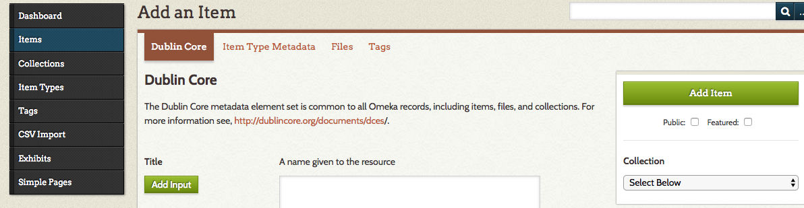
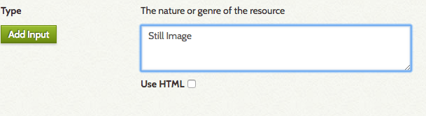

## About
Last Updated June 8, 2018  
Created by Sarah Clayton   
Software Versions: Omeka Classic Version 2.6.1 (hosted via OU Create) 

## Table of Contents
* [What is Omeka?](#what-is-omeka)
  * [Example Projects](#example-projects)
  * [Which Omeka to Use?](#which-omeka-to-use)
  * [Additional Resources](#additional-resources)
* [Omeka Workflow](#omeka-workflow)
* [Logging In and Navigating the Dashboard](#logging-in-and-navigating-the-dashboard)
* [Items](#items)
  * [Adding an Item](#adding-an-item)
    * [Dublin Core Metadata](#dublin-core-metadata)
    * [Item Type Metadata](#item-type-metadata)
    * [Files](#files)
    * [Tags](#tags)
  * [Editing An Item](#editing-an-item)
  * [Deleting An Item](#deleting-an-item)
* [Collections](#collections)
* [Exhibits](#exhibits)
* [Expanding Omeka](#expanding-omeka)
  * [Recommended Plugins](#recommended-plugins)
  * [Using HTML](#using-html)

## What is Omeka?
[Omeka](https://omeka.org/classic/) is an open-sourced content management system (CMS) developed by the [Roy Rosenzweig Center of History and New Media at George Mason University](https://rrchnm.org/). Omeka was created to share digital collections and build online exhibits. It has an easy to use interface that allows users to create websites without any coding. In this tutorial, we will go through how to add items (and metadata about those items) to a digital collections in Omeka and then create rich exhibits using those collections.

[Return to Top](#about)

### Example Projects
Omeka has been used since 2007 in a wide variety of projects. You can view example project in the [Omeka Classic Directory](https://omeka.org/classic/directory/). Take a few minutes to look through some of the different projects built on the platform. 

The University of Oklahoma Libraries' Digital Scholarship Lab (DSL) has been involved in the creation of several Omeka sites. Here are two examples from our Lab. 
* [Making of Modern America: Discovering the Great Depression and New Deal](http://newdeal.oucreate.com/)
* [Project Jordan: The Wives of English Kings](http://www.jordanproject.oucreate.com/)

[Return to Top](#about)

### Which Omeka to Use?
Omeka has several different derivatives depending on your needs. The tutorial will be using a self hosted version of Omeka classic; however, the instructions will likely transfer over to other versions with little difficulty.If you want to learn more about the different iterations of omeka, please see the descriptions below. 

**For students, faculty, and staff at the University of Oklahoma, please see our [tutorial on getting started with OU Create and Omeka](https://oudsl.github.io/OUCreate_and_Omeka/).**

The first distinction is **omeka.net vs omeka.org**. Omeka.net is Omeka's hosted service. You create an account and have access to a limited number of plugins and storage. [Programming Historian has a great tutorial on using getting started with omeka.net](https://programminghistorian.org/en/lessons/up-and-running-with-omeka). The advantages of using omeka.net are that it is easy to set up and you don't need access to a server or IT support to install Omeka on said server. The disadvantages are the lack of storage and ability to access the full range of plugins. The self-hosted omeka downloaded from omeka.org gives you much more flexibility. OU users can easily create a self-hosted site omeka site using [OU Create](https://create.ou.edu/).

Another newer distinction is **Omeka Classic vs Omeka S**. Omeka Classic is the standard omeka site while Omeka S is useful if you are managing multiple omeka websites. For this tutorial, we will be using Omeka Classic. 

[Return to Top](#about)

### Additional Resources
Much of the material in this tutorial is adapted from [Omeka's documentation](https://omeka.org/classic/docs/). You can refer to this if you have questions outside the scope of this tutorial. The [Omeka forums](https://forum.omeka.org/) are also a rich source of information. OU students, faculty, and staff can also schedule consultations with the [DSL staff](https://libraries.ou.edu/employees?combine=&field_title_value=&field_departments_tid=399).  

[Return to Top](#about)

## Omeka Workflow
This tutorial will walk you through some of the basic tasks you will likely do in Omeka. Please refer to the approriate sections below for the instructions. 

1. Log Into Omeka and Navigate the Dashboard
2. Add Items and related metadata to Omeka
3. Add Items to Collections
4. Create an Omeka Exhibit

*Note: The best way to become comfortable with Omeka is to use it! You don’t have to follow this guide step by step, but you can use as a resource if you get confused or feel overwhelmed. Explore and play with the platform. You will quickly discover how the tool works best for you.*

[Return to Top](#about)

## Logging In and Navigating the Dashboard
After you have your omeka site installed ([Please see our setup tutorial for detailed instructions using OU Create]((https://oudsl.github.io/OUCreate_and_Omeka/))), go the the URL you selected for you Omeka site and append /admin. For example, if your Omeka site's URL is omeka.oucreate.com, type in omeka.oucreate.com/admin. 

This url will direct you to a log in screen for your site. Please enter the username and password you selected when you created the site. If you have forgotten your password, you can using the **Lost your password link** at the bottom of the log in box to reset it. If you site was created using OU Create, you can also log into to your OU Create account and use the CPanel to change your username and password. 

After logging in, you will be redirected to your dashboard. This is your base of operations for controlling the content of the website. Take some time to familiarize yourself with the interface. 

There are two main ways of accessing different areas of the site. The main navigation bar is on the left side of the screen. You can also navigate to some of the sections of the dashboard by clicking the numbers on the top center of the page. The numbers are reflective of all of the content on the Omeka site.

The dashboard will also quickly show you the items and collections that have been edited most recently. 

[Return to Top](#about)

## Items
ITEMS are the building blocks of your Omeka site. An item is any sort of resource you add to Omeka. Items can include images of archival documents, photographs, audio recordings, and videos. You will create collections and exhibits using your items. 

Click **Items** on the navigation bar to go to the main items page. Here you will see a list of items have already been added to the site. You will have options to **Add an Item**, **Show Details** and **Search Items**. 

Let's begin by adding an item to our collection. 

[Return to Top](#about)

### Adding An Item
First, click on the green **Add an Item** button. 

This will take you to a new screen with four tabs across the top: **Dublin Core**, **Item Type Metadata**, **Files**, and **Tags**. We will go through each of these tags one at time in the remainder of this section. 

*Note: Three out of four of the tab relate to metadata or "data about data". Metadata is information about the item you are uploading. You need good metadata to ensure that the item you upload is identifiable and discoverable.* 

For the purpose of this tutorial, we will upload and describe a historical baseball card from the Library of Congress's collections. We selected this item because the LOC has already provided most of the metadata we need and the item is in the public domain, which means we do not need to worry about copyright restrictions. 

[We will use the baseball card of Detroit Tigers player, Ty Cobb, for this example](http://www.loc.gov/pictures/collection/bbc/item/2007685675/). You can also [search through the collection](http://www.loc.gov/pictures/collection/bbc/) for other cards if you would prefer to add a different player. 

Please note that although there are several sections describing how the add an item it is a fairly straight forward process once you understand the meaning behind all of the fields. If you need to stop in the middle of adding an item, you can click the green **Add Item** button on the left side of the screen. You can then go back to finish creating the item record using the edit feature, which will be covered below. 

Below the Add Item button you can select a collection for the item. We will cover collections extensively in the Collections section. You can also go back and add items to collections later so do not worry about it yet unless you already have an appropriate collection created. 

[Return to Top](#about)

#### Dublin Core Metadata
The first tab (and the one you should be on by default) is **Dublin Core**. If for some reason, you are not on this tab, click Dublin Core at the top. Dublin Core is one of the most commonly used metadata schemas. This essentially means that is a standard way to gather and represent describe items. Using these standardized schemas allows different systems to work together and be interoperable. The [Digital Public Library of America](https://dp.la/) is a great example of what can be done when metadata is standardized. 

Dublin Core was created to be flexible and easy adaptable to a variety of materials and projects. In Omeka we are using Simple Dublin Core, which includes fifteen elements or fields. All fifteen may be relevant to your item or some may not apply. See the descriptions within Omeka for more details about each field. Remember the more information you can provide the more useful your site will be to visitors. 

We will now go through each of the elements and apply them to the [Ty Cobb baseball card](http://www.loc.gov/pictures/collection/bbc/item/2007685675). Some of the fields are extremely clear; others are more ambiguous and will require you to use your best judgement. 

[Return to Top](#about)

##### Title
The title field seems pretty self-explanatory and normally is so. This is where you enter the title of the resource; however, in practice, some of your items may not have a clear title. If there is not an obvious title from looking at the resource, check to see how your source has titled the item. According the Library of Congress, the title for our baseball card is “[Ty Cobb, Detroit Tigers, baseball card portrait].” The brackets indicate that this is a title created by the LOC because there was no printed title available on the baseball card.  If the source for the item you are uploading has no title listed, you can create one in a similar fashion. **You should include a title for every item you upload.** Omeka will label your items using the title.

[Return to Top](#about)

##### Subject
The Subject is the topic of your resource. They are similar to tags, which we will discuss below. Each item may have multiple subjects. Each individual subject will need to be inputted separately in order to make them more searchable. To create a second box for another subject, click the green **Add Input**.

Just as it is valuable to have a standardized metadata schema, it is also worthwhile to implement **controlled vocabularies**. By having a set list of terms you can select from for your subjects, you will make it easier to link items with similar themes together.  Many of these vocabularies already exist. The [Library of Congress Subject Headings](http://id.loc.gov/authorities/subjects.html), the [Getty Art & Architecture Thesaurus](http://www.getty.edu/research/tools/vocabularies/aat/), and the [Getty Thesaurus of Geographic Names](http://www.getty.edu/research/tools/vocabularies/tgn/index.html) are some of the most commonly used vocabularies. You can also create your own controlled vocabulary list using a plugin called [Simple Vocab](https://omeka.org/classic/docs/Plugins/SimpleVocab/), which will be discussed in more detail in the Expanding Omeka with Plugins section. 

For our baseball card, we can use the subject provided for us by the LOC. These subjects are derived from the LOC subject headings.

Remember to add a new text box or input for each subject!  

[Return to Top](#about)

##### Description
Description is a free-form text box. You can decide exactly how you would like to use this field. Just be consistent! Often this element is used for a summary of the resource. This can include biographic or historical information or even a physical description of the resource. Use your best judgment about what to include. Do not be overly concern about repetition. For our example, we will write a short description of the baseball card. 

[Return to Top](#about)

##### Creator
The creator is the entity responsible for making the resource. This could be a person or organization. You may also not be able to determine the creator. A creator may be listed as a photographer, author, or illustrator. There also may be multiple creators. Occasionally, you even have a creator for the original object and a creator for the digital representation. If you are listing multiple creators, please include each in his or her own input field. In this example, we will include American Tobacco Company as the creator since there is no other creator information. If you do not have any information about the creator, you may leave this field blank. If you are adding a photo you took, make sure to list yourself as the creator! 

[Return to Top](#about)

##### Source
The source is where you found this resource. The source can can come in a variety of formats. The source may the permanent link for an object available online. It could also be the name of a repository or archive where the physical object is held. If you have both a URL and information about the archive or repository include both in separate input boxes. We have both for our example. You could also include a source input box indicating that an image comes from a larger work such as a book. For the URL, you can create a hyperlink to the source by checking the HTML box, and then selecting the **insert/edit link** button. 

[Return to Top](#about)

##### Publisher
The publisher is the entity responsible for making the resource available. This could be an individual, person, or organization. Our poster was issued by the American Tobacco Company and made available online by the Library of Congress so we will include both of these as publishers. Some of the material you find in the archives may be unpublished. If that is the case, then leave this field blank. 

[Return to Top](#about)

##### Date
Date seems like a simple field, but can be surprising complicated. With qualified Dublin Core, you can specify if you mean date created, date added, date modified, and so on. Just make sure you are consistent with how you use this field. If you want to use the more specific date fields, you can add qualified Dublin Core through a plugin. 
 
We also need to use a standardized format for our date. [ISO 8601](https://en.wikipedia.org/wiki/ISO_8601) is the standard for the representation of date and time. The formation of your date depends on your date. Dates should be formatted as YYYY-MM-DD, YYYY-MM, or YYYY depending on your data. According to the Library of Congress metadata the card was created in 1911. 

[Return to Top](#about)

##### Contributor
The contributor field is a place to list anyone or organization that has made a contribution to a resource. This field should include entities not already in another field. For example, you could include an editor here. You may not need to use this field. 

[Return to Top](#about)

##### Rights
This is an essential field that you should consider while gathering and creating resources. If you are including an item from an archive or collection, you need to ensure that the items are not in copyright and able to legally be used in your site. If you are unsure, check with the archive or repository about rights and use restrictions.  There are two common ways the resources are easily useable: public domain and or it has a creative commons license. 

Some of the resources you may want to use should be in the public domain. In general, most items created pre-1923 are in the public domain (there are some expectations to this rule). Also all works created by the US Government are automatically entered into the Public Domain. Our baseball card is the the public domain because it was published in 1911. 

Other resources you have find may be reusable via a Creative Commons License. If you see Creative Commons logo (see the image below, check the Creative Common licenses descriptions to see what the restrictions are. All of the CC licenses, will let you re-use with proper attribution. (You should have the proper attribution already if you fully completed the other Dublin Core fields). The differences are if you are allowed edit and create derivatives from the original. These differences shouldn’t be particularly relevant to your most of your projects. Wikimedia Commons is a great place to find images that have a CC license or are in the public domain. If you have a question about rights, don’t hesitate to ask! It is a confusing subject area.

If you are adding items that you created in your project, then as the creator, it is up to you to determine the rights restrictions. We would highly recommend including a [CC license](https://creativecommons.org/licenses/) on your item. This way you are allowing others to build upon your work and promoting an open and collaborative scholarship. 

Back to our example, add a statement letting your users know that the baseball card is in the public domain. 

 

[Return to Top](#about)

##### Relation
The relation field should point to a related resource. One common use is to indicate that the item you are adding is part of a larger resource like a chapter out of a book. 

In the example of the Ty Cobb baseball card, the LOC metadata tells us that it is part of the Benjamin K. Edwards Collection. Add that information to the Relation text box.

*Note: You may not need to use this field if it isn't relevant to your item.*

[Return to Top](#about)

##### Format
The format field could encompass both the physical and digital. Like the other ambiguous elements, you will need to decide how you want to use it. You can use multiple inputs to do both. For our baseball card, we can note three formats from the LOC metadata -- baseball card, chromolithograph with hand-color, and jpg. 

[Return to Top](#about)

##### Language
This field is for the language of the resource. We recommend the ISO 639-1 language code. Most of your items will be in English. The code for English is en. If you have an item in a different language, Wikipedia has a partial list of the [ISO 639-1 codes](https://en.wikipedia.org/wiki/List_of_ISO_639-1_codes).  If there are multiple languages used, include each language in separate input boxes. 

[Return to Top](#about)

##### Type
Type refers to the nature or genre of the item. We recommend using the item types within Omeka for consistency with the item type metadata . For the full list, you can refer to Item Types page within Omeka, which you can navigate using the side navigation bar. For our baseball card, we will enter the Still Image as the item type. 

[Return to Top](#about)

##### Identifier
Materials you get from an archive may already have a unique identifier assigned to it. If the resource has a unique identifier from it’s source (Call number, Archives collection/series/box/folder) then include that in this field. The Baseball Card has an LOC call number so we will add that to  the identifier box. 

[Return to Top](#about)

##### Coverage
The final Dublin Core field is coverage, which can include two different types of information -- geographic and temporal. Basically, you can put a location and time information in this element. In our example, we will do both. We will put Michigan--Detroit in the first input and 1910s in the second. 

That concludes the standard Dublin Core fields. Now, we can take a look at the other tabs in the Add an Item interface. 

[Return to Top](#about)

#### Item Type metadata
Click on **Item Type Metadata** at the top of the page. Select the dropdown menu to see all of the possible types. As we decided above, our baseball card best fits in the **Still Image** category. Select that option from the dropdown menu. 

After selecting Still Image, two new text boxes should appear. Each item type has a unique set of additional fields to you have the option to complete. For still images, the fields are original format and physical dimensions. Since the LOC metadata does not include the physical dimensions, we will just add the original format. 

[Return to Top](#about)

#### Files
Now, we can add the images to our metadata. The baseball card has two images -- a front view and a back view. We will want to upload both. Download the images from the [LOC page](http://www.loc.gov/pictures/collection/bbc/item/2007685675/) if you have not already done so and save them in a location you can easily locate. 

First, click **Files** at the top of the screen. Click **Choose File** and select the image you want to upload. Then, click the green **Add Another File** to add another **Choose File** button. Use this button to add the other image. 

[Return to Top](#about)

#### Tags
The final tab in Add an Item is Tags. Tags are a less formal way to categorize that item.  If you have ever used flicker of a hashtag on twitter or Facebook, you have created tags. Try to think of words or phrases that someone might use to search the collection. Even though we are not using a formal controlled vocabulary, we still do need to strive for consistency in our tagging system. For example, we would not want both “Park” and “Parks” to be tags. 

You can enter all of your tags at once by entering them in the text box separated by commas. Make sure that you click the green Add Tags before moving on from this section. When your tags are added, they will appear in green boxes in this section. For this example, we will add baseball, Detroit Tigers, and outfielder as tags. Feel free to add as many additional tags as you would like. Remember to separate tags with a comma. Click **Add Tags** when you are done. 

*Note: After you have added some tags, pre-existing tags will be suggested when you are start typing in new tags. Pay attention since this can help prevent mistakes like having a plural and singular version of the same tag.*

Now, click on the green **Add Item** button on the right side of your screen to add the file and its associated metadata to your collection as an item. Under the **Add Item ** button, you can choose to make your item public or featured, which in most themes will automatically place the item on your front page. You can also choose to add it to a collection, if you already have one set up. For now, we will leave all of these actions unchecked and add our baseball card.  

[Return to Top](#about)

### Editing an Item
After you have already added an item, you may want to go back and make some edits. Omeka makes this easy. Select **Items** the left hand navigation to go to the list of all your items. 

Then, select click the blue **Edit** button right below the name of the item. This will open up the same interface we worked with when adding the item. 

Make any changes you want. Just make sure to click the green **Save Changes** button when you are done.  

[Return to Top](#about)

### Deleting an Item
Occasionally, you may want to delete an item you have added. Do this with caution because you cannot easily reverse this. Consider making an item private if you do not want it to be displayed on the site but may want to use it in the future. 

To delete item, click the blue **Delete** button underneath the item's title on the Items page. When you click delete, a dialog box will appear asking you to confirm the deletion. If you are sure, click **Delete**; otherwise, exit out of the dialog box. 

[Return to Top](#about)

## Collections

[Return to Top](#about)

## Exhibits 

[Return to Top](#about)

## Expanding Omeka

[Return to Top](#about)

### Recommended plugins

[Return to Top](#about)

### Using HTML 

[Return to Top](#about)
